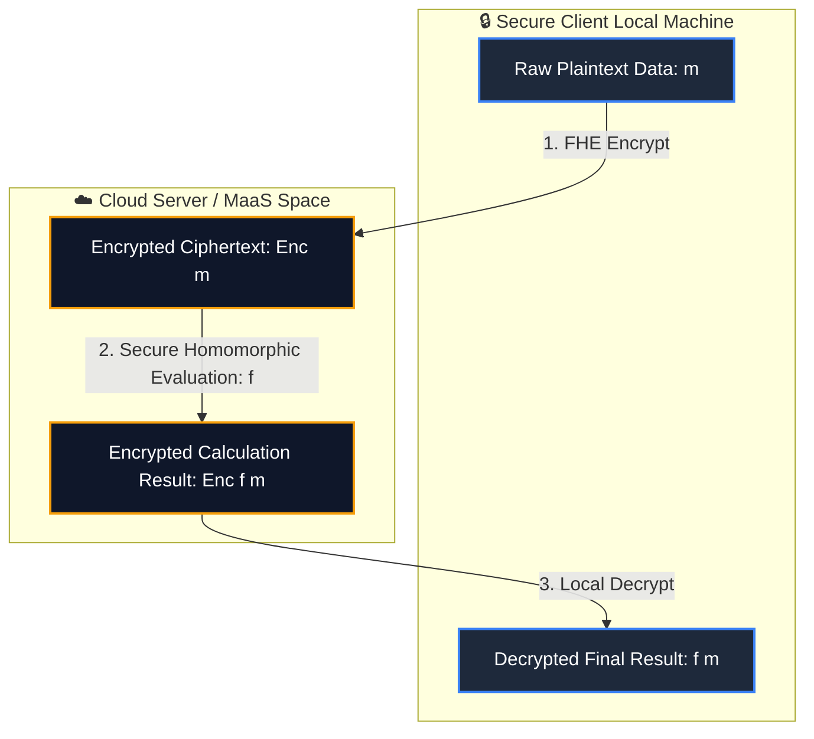
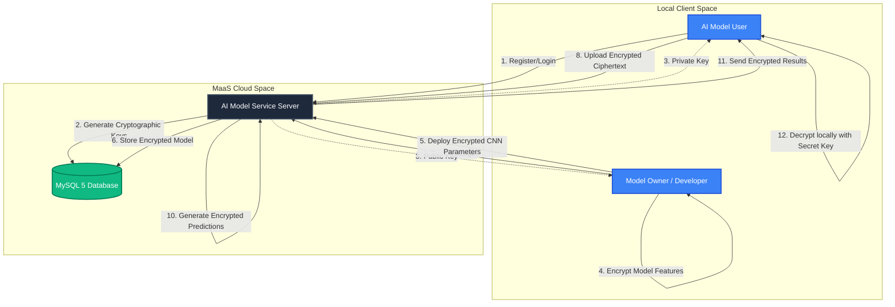

Privacy-Preserving Model-as-a-Service (MaaS) Platform

An enterprise-ready, cryptographically secure Model-as-a-Service (MaaS) microservice and web application built with Python and Flask. This project introduces a secure cloud-based AI service framework implementing Fully Homomorphic Encryption (FHE) via Microsoft SEAL (PySEAL).

It enables untrusted cloud infrastructure to execute high-performance machine learning inference directly on encrypted user data. The underlying algorithms guarantee that neither private user inputs nor proprietary model parameters are decrypted during computation, eliminating the risk of data breaches, model inversion, or inference leakage attacks.

🔒 Cryptographic Core: Fully Homomorphic Encryption (FHE)

Traditional encryption schemes protect data "at rest" and "in transit" but require decryption "in use" (during processing). This project implements the Brakerski-Fan-Vercauteren (BFV) homomorphic encryption scheme, allowing mathematical operations to be executed on encrypted ciphertexts:

Mathematical Foundations

Additive Homomorphic Property: Adding two ciphertexts yields an encrypted sum without decrypting the values:

$$\text{Dec}(\text{Enc}(m_1) \oplus \text{Enc}(m_2)) = m_1 + m_2$$

Multiplicative Homomorphic Property: Multiplying two ciphertexts yields an encrypted product:

$$\text{Dec}(\text{Enc}(m_1) \otimes \text{Enc}(m_2)) = m_1 \times m_2$$

Arbitrary Function Evaluation: For any model computation pipeline represented by a circuit $f$:

$$\text{Dec}(f(\text{Enc}(m_1), \dots, \text{Enc}(m_n))) = f(m_1, \dots, m_n)$$

In this system, the Plaintext Modulus is configured to $t = 1024$ and the Polynomial Modulus Degree to $N = 4096$, balancing robust security guarantees against quantum-class attacks with real-world execution speeds.

🧠 System Architecture & Workflow

The platform decouples operations among three distinct entities: the Model Owner, the Model User, and the MaaS Cloud Service Provider (Admin), using a zero-trust model.

🚀 Key Features

End-to-End Encryption: Inputs remain securely masked as random-noise ciphertexts during transmission, database storage, and active execution phases.

Microsoft SEAL Core: Built on top of PySEAL bindings to guarantee high-throughput, memory-safe, and hardware-optimized lattice-based cryptographic computations.

Integrated Facial Recognition Case Study: Features an integrated CrimeNet face classification module (93.54% validation accuracy) to demonstrate privacy-preserving suspect matching.

Multi-Tenant Access Control: Dedicated, secure routing, credential hashing, and session management for Admins, Developers, and Public Users.

Live System Auditing: Full database logging of active query counts, calculation processing latencies, client IP addresses, and FHE parameter metrics.

🛠️ Technology Stack

Backend Engine: Flask 1.1 (Python 3.8)

Cryptographic Engine: Microsoft SEAL (PySEAL)

Neural Networks & ML: TensorFlow, Scikit-Learn, NumPy, Pandas, Matplotlib

Database Management: MySQL 5.x / MariaDB (connected via mysql-connector)

Local Hosting Stack: WampServer / XAMPP (Apache web container)

Frontend Design: HTML5, CSS3, Bootstrap 4 (responsive layouts)

💻 Local Installation & Database Setup

Follow these instructions to configure and run the privacy-preserving application on your local machine:

Prerequisites

Operating System: Windows 10/11

Runtime: Python 3.8 (64-bit recommended)

Web Server Stack: WampServer or XAMPP installed and running

1. Database Setup (MySQL)

Boot up WampServer and open phpMyAdmin in your browser (http://localhost/phpmyadmin).

Create a new database named: MaaS_model.

Import the database structure. In your terminal, run the following command (or paste your schema .sql file inside the phpMyAdmin console):

CREATE DATABASE IF NOT EXISTS MaaS_model;
USE MaaS_model;

-- Table for developer registration records
CREATE TABLE IF NOT EXISTS am_developer (
    id INT AUTO_INCREMENT PRIMARY KEY,
    name VARCHAR(255) NOT NULL,
    mobile VARCHAR(15) NOT NULL,
    email VARCHAR(255) NOT NULL,
    location VARCHAR(255) NOT NULL,
    country VARCHAR(255) NOT NULL,
    uname VARCHAR(255) NOT NULL UNIQUE,
    pass VARCHAR(255) NOT NULL,
    create_date VARCHAR(50) NOT NULL,
    public_key TEXT,
    private_key TEXT
);

2. Configure Local Virtual Environment

Clone the repository and build an isolated runtime sandbox:

git clone https://github.com/afnanp901-beep/aiaas-flask-model.git
cd aiaas-flask-model

python -m venv venv
venv\Scripts\activate

3. Install Core Dependencies

Install the cryptographic binaries alongside standard mathematical packages:

pip install -r requirements.txt

(Note: Ensure PySEAL binaries matching your Python architecture are correctly referenced inside your local search paths).

4. Boot the Application Server

Start your server instances using the default local route:

python main.py

Now, navigate your web browser to http://localhost:5000 to access the homepage!

🔬 System Evaluation & Test Report

Test ID

Input / Action

Expected Output

Status

TC001

User uploads encrypted biometric image

Accepted and queued for computation

Pass ✅

TC002

User attempts raw plain text upload

Rejected with manual encryption notice

Pass ✅

TC003

Circuit arithmetic computation ($E(m) \otimes E(w)$)

Correctly outputs output ciphertext $E(y)$

Pass ✅

TC005

Authorized decryption key applied

Ciphertext returns clean plaintext details

Pass ✅

TC006

Incorrect private key execution

Decryption routine yields cryptographic noise

Pass ✅

🔮 Future Enhancements

Mobile Integration: Building native iOS and Android application templates for secure on-the-go FHE inquiries.

Immutable Audits via Blockchain: Integrating decentralised distributed ledgers to securely record encrypted access trails.

Large-scale GPU Optimization: Offloading homomorphic evaluations to CUDA pipelines to significantly reduce latency on highly complex layers.
